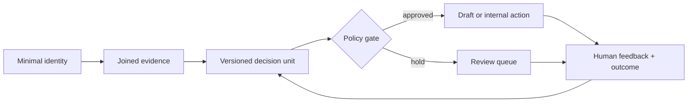

# Agentic GTM Systems

Public, implementation-oriented patterns for building governed GTM agents. The emphasis is not on autonomous volume. It is on evidence, bounded authority, durable state, explicit next actions, and feedback that improves a versioned decision unit.

## What is here

| Area | Contents |
|---|---|
| [Project catalog](docs/catalog/README.md) | Public map of significant systems, their safe publication form, and standalone repositories |
| [Architecture and concepts](docs/README.md) | Layer boundaries, n8n/MCP control-plane design, memory, evidence, receipts, autonomy, and review |
| [Skills](skills/README.md) | Reusable agent skills for bounded resolution loops, test loops, messaging QA, MCP audits, and tool experts |
| [n8n](n8n/README.md) | Inactive, credential-free workflow blueprints with setup and validation notes |

## Core design rules

1. Preserve raw evidence and separate it from inference.
2. Put policy gates before expensive work and before every outward action.
3. Make every autonomous loop finite, stateful, resumable, and machine-checkable.
4. Treat credentials, customer data, and operational IDs as deployment state, never source code.
5. Let humans approve consequences, not hidden model reasoning.
6. Attribute outcomes to the exact prompt, workflow, and policy version that produced them.

## Public-release boundary

This is a curated pattern library, not a snapshot of a production environment. It intentionally excludes credentials, customer or prospect data, internal endpoints, account-specific logic, live campaign IDs, browser profiles, private paths, and enabled outbound workflows. See [SECURITY.md](SECURITY.md).

Standalone public projects are tracked in the [project catalog](docs/catalog/README.md). A standalone repository is used only when the artifact is independently runnable. Shared subsystems stay here as architecture and contracts instead of being copied out of a private production tree.

## Status

The repository is suitable for study and adaptation. The n8n exports are inactive blueprints and must be reviewed, wired to credentials, validated, and tested in the target n8n instance before use.
