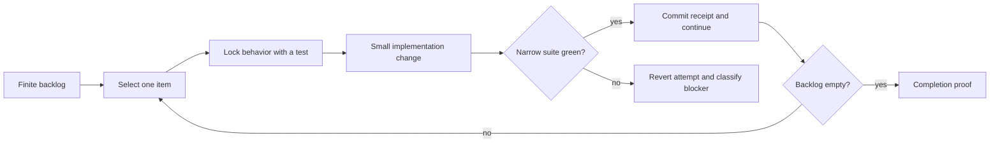

# Bounded maintenance loop

Autonomous maintenance is safe when the loop is finite, contract-first, and able to revert its own failed attempt.

## Required rails

1. A frozen backlog and explicit completion promise.
2. One branch or isolated worktree for the loop.
3. Characterization tests before changing unclear behavior.
4. Narrow public interfaces with implementation hidden behind them.
5. Green-or-revert handling for every backlog item.
6. A durable ledger containing attempts, test results, and blockers.
7. A hard iteration cap or terminal blocked state.

The loop fixes implementation causes, not tests that correctly expose a failure. It does not perform external actions, expand scope, or redesign architecture while repairing a backlog item.
