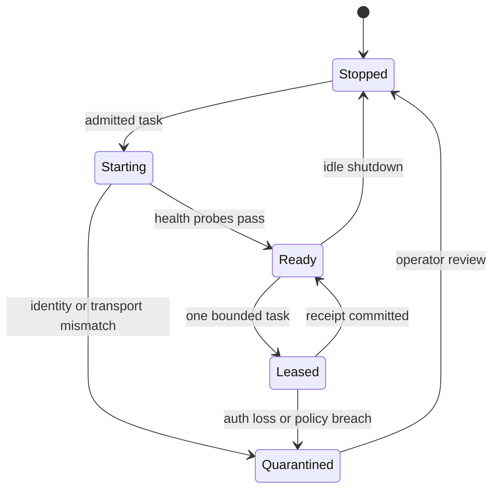

# Browser lane supervisor

Authenticated browser automation needs two independent controls: identity isolation and workload admission. A browser profile answers who the browser is. A lane lease answers whether a task may use that identity now.

## Supervisor responsibilities

1. Resolve a named lane to one persistent identity profile.
2. Start it on demand and verify transport, authentication, and identity.
3. Grant a time-bounded lease to one admitted workload.
4. Enforce read-only or write-capable policy independently from tool code.
5. Record task start, completion, breaker state, and released capacity.
6. Stop idle lanes instead of relying on an always-on port zoo.

## Failure boundaries

A caller must not choose a fallback identity when its requested lane is unavailable. Authentication loss, checkpoint pages, rate limits, and identity mismatch trip a global breaker for that lane. A browser process being alive is not proof that the lane is safe.

Session files, profile directories, cookies, identity labels, and live ports are deployment configuration. The public contract is the state machine, lease model, and proof requirements.
