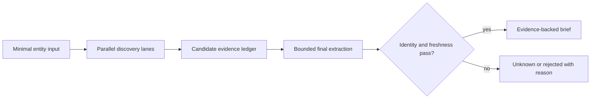

# Evidence research pipeline

An agent research brief should separate discovery from proof. Search results, generated answers, and snippets can nominate sources. Only final extraction from the source itself can support a claim.

## Lane contract

Each discovery lane has one purpose, a bounded query budget, and a typed result. Typical lanes cover official workflows, strategic initiatives, engineering activity, data boundaries, market context, and the relevant people. Lanes may run concurrently because they do not mutate shared state.

The join step deduplicates sources and records which lane nominated each item. A final extraction wave reopens only the shortlisted sources. This keeps the expensive proof pass bounded and prevents a generated search answer from becoming evidence by repetition.

## Fail-closed behavior

- Entity conflicts produce an unresolved result, not a guessed merge.
- Missing source text produces an unknown, not a paraphrased claim.
- Stale evidence can provide background but cannot trigger a time-sensitive decision.
- People require current-role proof before appearing in a decision unit.
- Provider failure degrades the brief and remains visible in the coverage ledger.

The output should remain useful when no timely signal exists. A neutral, evidence-backed baseline is better than a fabricated reason to act.
