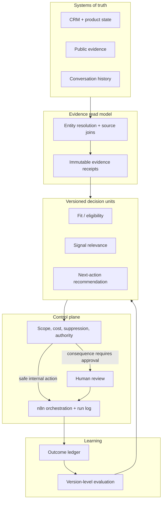

# Governed agentic GTM architecture

The durable unit in an agentic GTM system is not a prompt or a monolithic agent. It is a small, versioned decision contract that joins evidence, applies policy, produces an explicit next action, and records feedback.

## Layer responsibilities

| Layer | Owns | Must not own |
|---|---|---|
| Systems of truth | Authoritative source records | Agent-specific derived judgments |
| Evidence read model | Joined context, provenance, timestamps, entity confidence | Silent overwrites of source truth |
| Decision unit | Typed inputs/outputs, reasoning policy, evidence requirements | Credentials or transport-specific side effects |
| Control plane | Scheduling, budgets, scope, approvals, kill switches, audit logs | Unbounded free-form decision making |
| Execution adapter | One narrow tool or API action | Eligibility or policy decisions |
| Outcome layer | Results tied to exact versions | Retrospective claims without attribution |

## The sequence that prevents most failures

1. Resolve the entity.
2. Run cheap eligibility and suppression checks.
3. Collect only the evidence needed for the decision.
4. Preserve the evidence receipt.
5. Run the versioned decision unit.
6. Apply authority, cost, and consequence policy.
7. Emit one explicit next action or one explicit hold reason.
8. Record the outcome against the exact versions involved.

Putting eligibility after enrichment or drafting wastes money and creates forced-fit reasoning. Putting approval inside a model prompt makes it unenforceable. Both belong outside the reasoning unit.

## Safe default

Start with read models, decision packs, drafts, and review queues. Automation graduates only after measured stability and only for the narrow action class that earned it.
