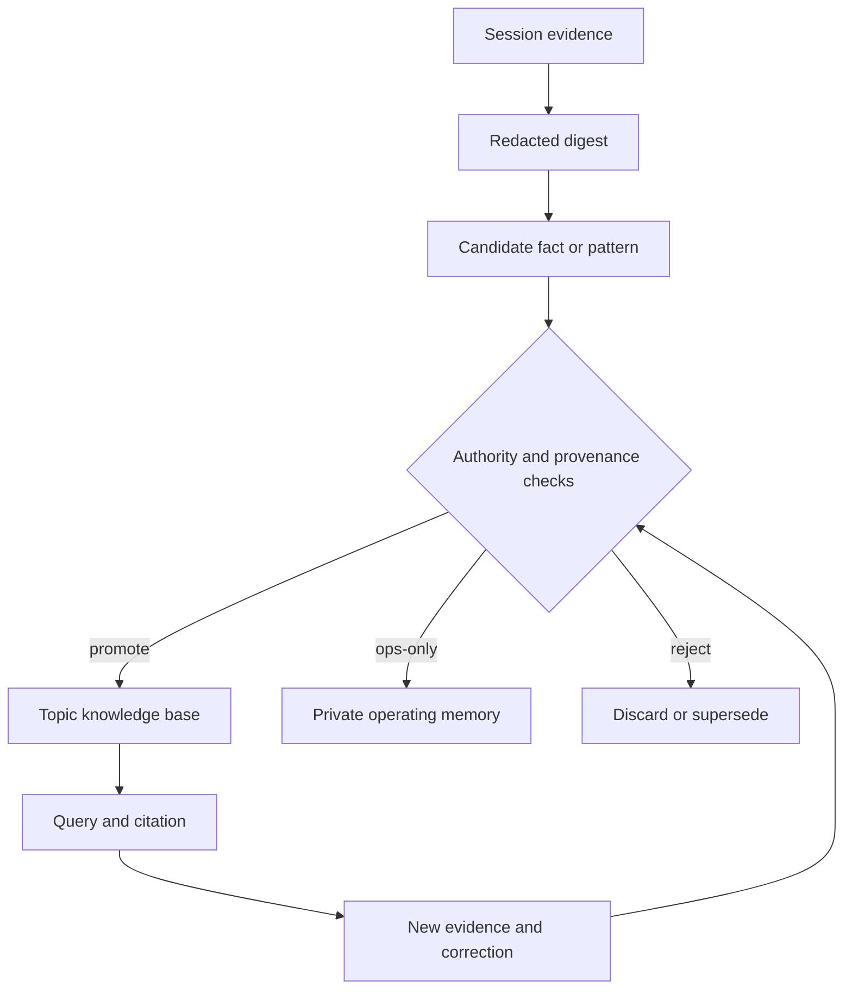

# Knowledge promotion loop

Durable agent knowledge should be compiled, not copied from chat. Session evidence is provisional. Topic knowledge becomes authoritative only after provenance, privacy, and contradiction checks.

## Three layers

- **Session evidence** preserves what happened without pretending every observation is durable truth.
- **Operating memory** holds private policies, runtime state, and local decisions.
- **Topic knowledge** holds sourced claims that can be queried and cited independently of a session.

Promotion requires a stable subject, source provenance, capture time, privacy classification, and an authority rule for conflicts. New evidence enriches or supersedes an article; it does not silently overwrite the earlier claim.

The public architecture contains schemas and promotion behavior. Private corpora, transcripts, operator identity, and access credentials remain deployment state.
