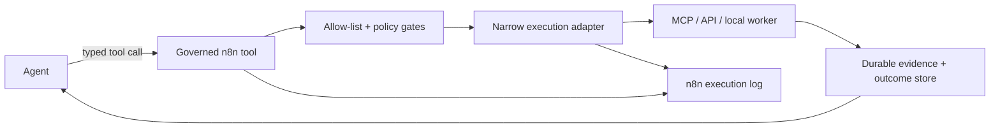

# n8n and MCP as a governed control plane

n8n works best as the visible orchestration seam between agents, typed tools, execution adapters, and durable memory. It should not become a second system of truth.

## Two bridge directions

1. **n8n consumes MCP tools.** A workflow uses typed data capabilities instead of reimplementing every API.
2. **n8n exposes selected workflows as tools.** An agent invokes a narrow, logged workflow instead of receiving broad shell or application access.

The second direction is a permission boundary. Expose a small allow-listed tool surface, not a workflow catalog or a generic command runner.

## What makes a good tool surface

- A verb the agent can reason about, with typed inputs and structured outputs
- Read-heavy and safe by default
- Idempotent where possible
- Explicit about cost, source, and freshness
- No browser-session plumbing in the public tool contract
- Writes split from reads and gated by consequence
- No credential values in workflow JSON

## Workflow publication checklist

Before activating a workflow:

1. Validate the workflow against the target n8n version.
2. Pull the saved workflow back and inspect the `connections` object.
3. Bind the intended credential IDs in the UI or credential-aware tooling.
4. Wire error outputs for every fallible node and set a workflow-level error workflow.
5. Test with representative pinned data. Confirm which nodes are not pinned and may produce side effects.
6. Publish only after the output, error path, and authority boundary are proven.

## Portability rule

Keep business policy and reasoning outside transport-specific nodes when possible. A workflow should orchestrate stable contracts. Replacing a CRM, enrichment source, or notification channel should not require rewriting the decision policy.
