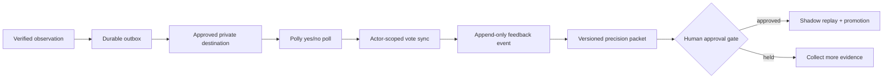
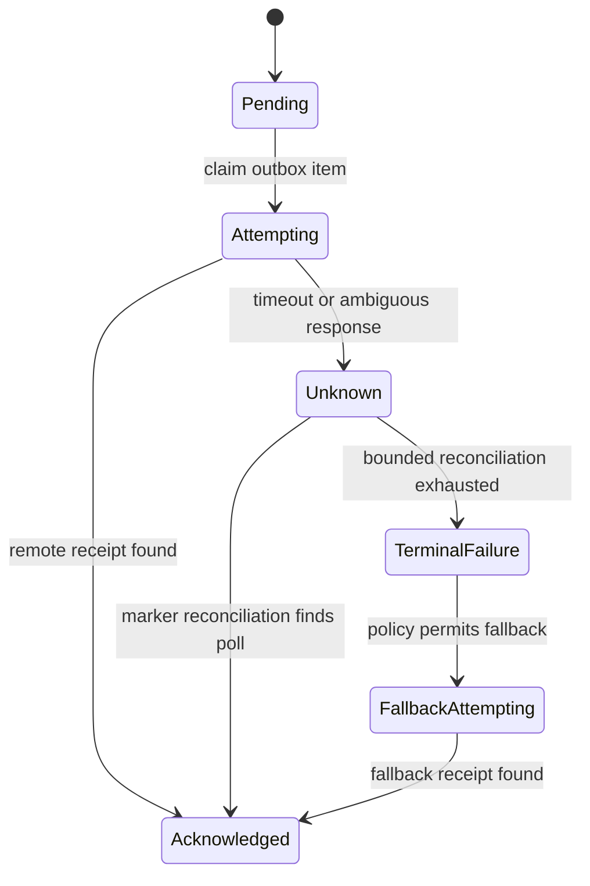

# Polly feedback loop

Polly is the human-feedback surface for an evidence monitor. Its job is not merely to display a poll. It closes a governed learning loop from one verified observation to one reviewer label, then from a body of versioned labels to a human-approved detector improvement.



This module extends the [signal monitor contract](../concepts/signal-monitor-contract.md), [receipts and idempotency](../concepts/receipts-idempotency.md), and [policy-gated autonomy](../concepts/policy-gated-autonomy.md).

## Trust boundaries

The monitor owns evidence collection and source verification. The delivery adapter owns one approved private destination and the interactive transport. Polly owns poll rendering. The feedback synchronizer owns label interpretation. The optimizer may recommend a new version, but only a human approval gate may authorize promotion.

These boundaries prevent a transport failure from changing evidence, a vote from silently editing a prompt, or an optimizer from expanding its own authority.

## Minimal durable records

| Record | Required fields | Invariant |
|---|---|---|
| Observation | `observation_id`, family, prompt version, source pointer, exact evidence, decision, observed time | Immutable after creation |
| Delivery | deterministic `delivery_id`, observation, destination scope, transport, remote receipt, effect state | One logical delivery per observation and reviewer |
| Feedback event | feedback ID, observation, label or retraction, actor, comment, captured time | Append-only; never overwrite history |
| Prompt proposal | family, from/to versions, base-config hash, evidence hash, patch, status | Proposal creation cannot mutate config |
| Prompt version | family, version, approved proposal, activation actor and time | Activation requires approved evidence and rollback material |

The current label is a projection over feedback events. History remains authoritative, so a changed vote or retraction is explainable.

## Delivery and reconciliation

Every poll question includes a stable, non-secret observation marker. Before creating a poll, the adapter searches the approved destination for that marker and adopts an existing result. The remote effect uses this state machine:



An `unknown` result must not immediately create a fallback message; the first poll may exist even when the command response was lost. An acknowledged delivery never returns to pending. Claims need an owner, expiry, and fencing generation so a stale worker cannot commit over a newer retry.

## Vote interpretation

Only the expected reviewer can label an observation. A positive choice maps to `useful`; a negative choice maps to `not_useful`. Both choices present at once produce `conflict`. No choice produces `unlabeled`. A removed vote produces a retraction event rather than erasing the prior label.

Optional comments are separate evidence. A transport adapter may use a poll result, a native reaction fallback, or another private interactive surface as long as it returns the same typed result:

```yaml
status: labeled | unlabeled | conflict | retracted
label: useful | not_useful | null
actor_ref: opaque-reviewer-reference
comment: optional bounded text
remote_receipt: opaque-transport-reference
```

Synchronization should order work by oldest `feedback_synced_at`, not merely the newest messages, so old unlabeled deliveries remain discoverable. A fingerprint of label, comment, actor, and retraction state makes repeated reads idempotent.

## Learning and promotion

Metrics are grouped by signal family and prompt version. A useful starting metric is labeled precision:

`useful / (useful + not_useful)`

Precision alone is not a promotion gate. A candidate version also needs a minimum sample, uncertainty policy, frozen labeled regression set, shadow replay against the current version, and a side-effect assertion proving that evaluation created no new deliveries.

Promotion follows a separate state machine:

`proposed → approved → promotion_planned → promoted | rolled_back`

Approval uses a proposal-specific phrase or equivalent signed action. Promotion verifies the base-config hash, writes a backup, applies the versioned patch, resynchronizes monitor specifications, and restores the backup on failure. The optimizer produces evidence packets; it never approves itself.

## Improvement backlog for a new machine

1. Add a transactional outbox between accepted observations and remote delivery.
2. Implement fenced claims and the full remote-effect state machine above.
3. Reconcile ambiguous poll creation before attempting any fallback transport.
4. Record vote removal and retraction while preserving append-only label history.
5. Poll feedback fairly by synchronization age and expose stale-feedback health metrics.
6. Require a frozen regression set, sample floor, uncertainty check, and zero-side-effect shadow replay before a proposal is promotable.
7. Keep transport adapters provider-independent and test them against synthetic poll payloads.

## Machine-checkable handoff

- Concurrent workers produce one acknowledged delivery for one observation.
- A timeout followed by reconciliation adopts the existing poll and creates no fallback duplicate.
- `useful → not_useful → removed` yields two label events plus one retraction and a null current projection.
- A delivery older than the newest page of messages is eventually synchronized.
- A proposal cannot mutate configuration before exact human approval.
- A failed promotion restores the previous config and monitor version.
- Shadow replay produces evaluation metrics and zero remote deliveries.
- Public fixtures contain synthetic entities and opaque identifiers only.

Workspace identifiers, reviewer identities, private destination IDs, credentials, source observations, account data, transport receipts, and labeled production evidence are deployment state and must not be published.
