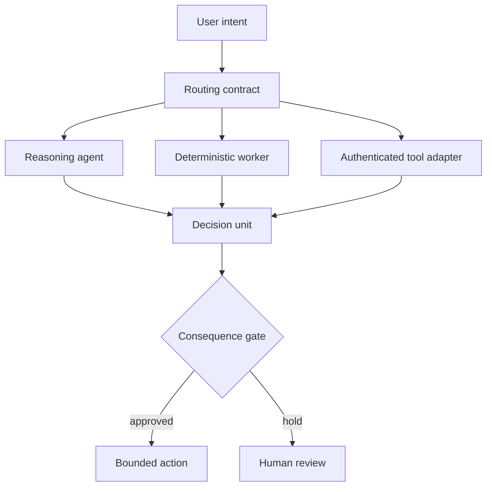

# Portable agent runtime

A reliable local agent stack separates judgment, deterministic execution, and authenticated tools. Model choice is a routing concern; authority belongs to policy and the user.

## Runtime contract

- The reasoning agent handles ambiguity, synthesis, and explicit tradeoffs.
- Deterministic workers own repeatable parsing, validation, scoring, and file transforms.
- Tool adapters own authentication and expose the smallest typed capability possible.
- Routing selects a capable surface but cannot broaden its permissions.
- Every long-running loop has a machine-checkable exit condition and durable state.

Machine paths, installed models, credentials, browser profiles, and tool-specific routing are deployment details. A portable release publishes the interfaces, fallback rules, and proof requirements instead.
