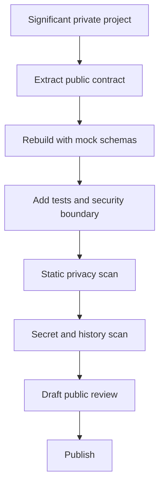

# Public architecture publication factory

The safest public release is a reconstruction. Copying a private folder and trying to delete sensitive files afterward leaves too many invisible failure modes: old history, generated artifacts, operational identifiers, and design assumptions tied to a private environment.

## Admission

A project qualifies when it has a durable runtime, a charter or architecture, meaningful tests, or repeated operational use. Qualification does not imply that its implementation should be public.

## Release forms

- **Architecture module:** contracts, state machines, mock schemas, and failure boundaries for a shared subsystem.
- **Portable skill:** a bounded workflow whose instructions do not require private state.
- **Inactive blueprint:** a credential-free workflow that cannot perform a live action after import.
- **Standalone repository:** independently runnable code with a precise privacy boundary.

## Mandatory gates

1. Fresh history or a demonstrably clean public-only history.
2. No credentials, private paths, personal email, operational identifiers, or authenticated payloads.
3. Synthetic fixtures only.
4. Outward actions absent or disabled by construction.
5. Security documentation that names what remains private.
6. Static validation, secret scanning, tests, and draft review before publication.

If any source artifact is ambiguous, it is evidence for reconstruction, not a file to copy.
