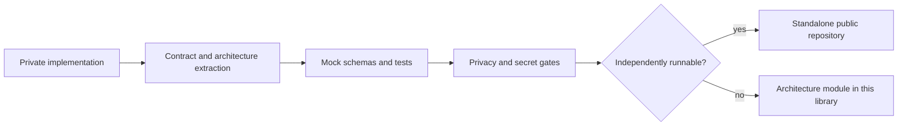

# Public project catalog

This catalog records the public-safe form of significant agent systems. It is deliberately smaller than the private implementation surface. A system belongs here when it has a durable runtime, tests, an architecture or charter, or repeated operational use.

## Standalone projects

| Project | Public surface | Boundary |
|---|---|---|
| Governed Sales Navigator read-only extension | [Repository](https://github.com/justus20santiago-web/salesnav-readonly-extension) | Browser credentials, production bridge, captured responses, identities, and private storage stay private |
| Ideaverse | [Repository](https://github.com/justus20santiago-web/ideaverse) | Local research history, private prompts, and authenticated tool state stay private |

## Architecture modules

| System | Public surface |
|---|---|
| Governed agent execution | [Governed agentic GTM](../architecture/governed-agentic-gtm.md) |
| Evidence-first research briefs | [Evidence research pipeline](../architecture/evidence-research-pipeline.md) |
| Browser identity and workload isolation | [Browser lane supervisor](../architecture/browser-lane-supervisor.md) |
| Durable knowledge compilation | [Knowledge promotion loop](../architecture/knowledge-promotion-loop.md) |
| Graph-backed evidence packets | [Evidence graph](../architecture/evidence-graph.md) |
| Model and tool role separation | [Portable agent runtime](../architecture/portable-agent-runtime.md) |
| Autonomous code maintenance | [Bounded maintenance loop](../architecture/bounded-maintenance-loop.md) |
| Safe public reconstruction | [Publication factory](../architecture/publication-factory.md) |
| n8n and MCP orchestration | [n8n and MCP control plane](../architecture/n8n-mcp-control-plane.md) |
| Signal discovery and qualification | [Signal monitor contract](../concepts/signal-monitor-contract.md) |
| Human signal feedback and prompt improvement | [Polly feedback loop](../architecture/polly-feedback-loop.md) |

## Reusable execution skills

The [skills catalog](../../skills/README.md) publishes the portable parts of bounded resolution, test loops, messaging quality, MCP audits, and tool-expert construction. Production adapters, credentials, recordings, and run artifacts are not part of those skills.

The machine-readable inventory is [`projects.json`](projects.json). Every entry names what remains private so public coverage cannot silently expand.
