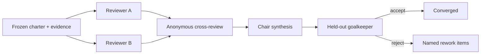

# Independent review and convergence

“Ask another model” is not a verification strategy when the second reviewer receives the first reviewer's framing, transcript, or conclusion. Independence comes from controlling context and authority.

## Roles

- **Workers** resolve individual items against the frozen charter.
- **Cross-reviewers** challenge evidence, assumptions, and unsupported confidence without seeing authorship.
- **Chair** synthesizes, but cannot certify its own result.
- **Reconvene reviewer** sees all concise resolutions and checks interactions across items.
- **Goalkeeper** evaluates the final artifact against the original charter and can only accept or return named rework.

## Context isolation

Give reviewers:

- the frozen goal and pass criteria
- the exact evidence they need
- the candidate resolution or artifact

Withhold:

- persuasive chat history
- the worker's private reasoning transcript
- labels that reveal which answer is favored
- claims that a prior reviewer already approved

## Boundedness

Persist reviewer counts, rework rounds, elapsed time, and repeated-objection hashes. A review system without brakes can spend indefinitely while creating the appearance of rigor.

If isolated verification is unavailable, fail closed to human review instead of calling a self-review independent.
