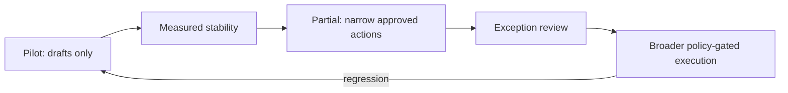

# Policy-gated autonomy

The practical ceiling for consequential GTM automation is policy-gated execution with exception-based review. Autonomy is earned by action class, not granted to an entire agent.

## Graduation ladder

| Stage | Automated | Human-owned |
|---|---|---|
| Pilot | Research, scoring, drafts, internal briefs | Every outward action |
| Partial | Low-risk actions inside frozen templates and scope | First touch, exceptions, sensitive claims |
| Policy-gated | Stable action classes within budgets and suppression rules | Exceptions and policy changes |

## Interception points

- **Before reasoning:** entity, scope, eligibility, suppression, and data-boundary checks
- **After reasoning:** groundedness, policy, consequence, spend, and collision checks
- **After action:** outcome capture, reply stop, anomaly detection, and external kill switch

Approval should cover the exact consequence and parameters. “Approve the agent” is not a useful permission model.
