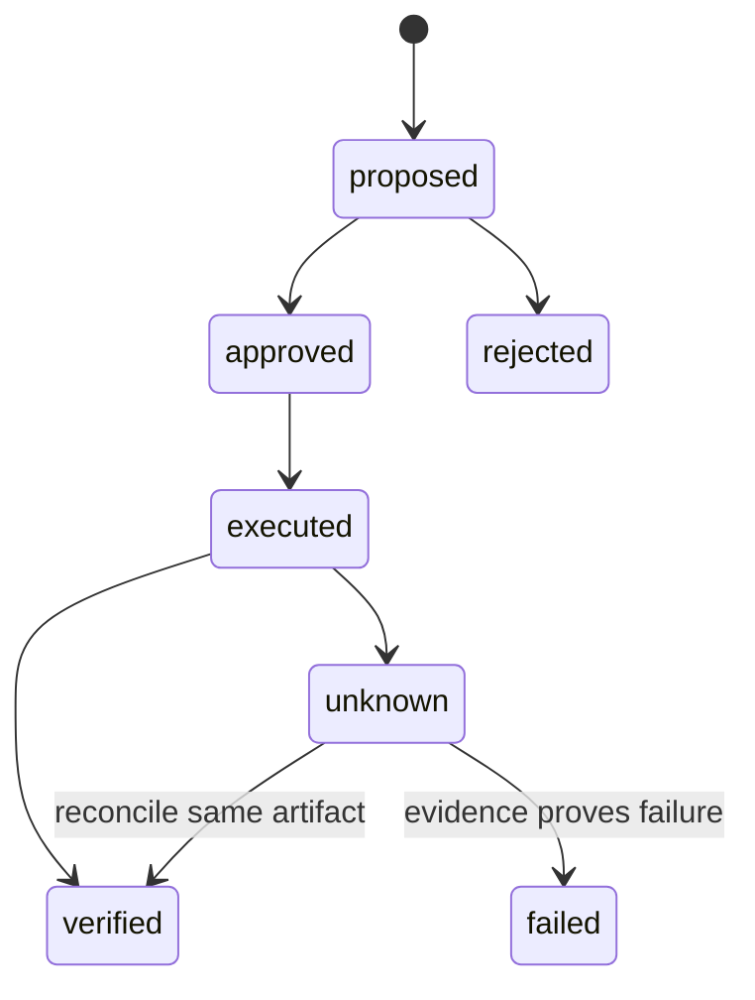

# Receipts and idempotency

Receipts turn an agent action from “the model said it ran” into a verifiable state transition.

## Minimal receipt

```yaml
receipt_id: rcpt_001
operation: prepare_campaign
input_hash: sha256:example
policy_version: 4
artifact_id: campaign_123
artifact_hash: sha256:example
state: prepared
created_at: 2026-01-01T00:00:00Z
actor: workflow_name
```

## Rules

1. Bind the receipt to exact inputs with a content hash.
2. Bind follow-up mutations to the exact artifact ID created by the first step.
3. Use a unique idempotency key for retries.
4. Reconcile ambiguous responses by reading the original artifact, never by creating a sibling.
5. Keep state transitions monotonic unless a compensating action is explicit.
6. Treat `unknown` as a real state that requires reconciliation.



Idempotency is not only duplicate prevention. It is the ability to retry safely while preserving which artifact, input, and policy version the operation belongs to.
